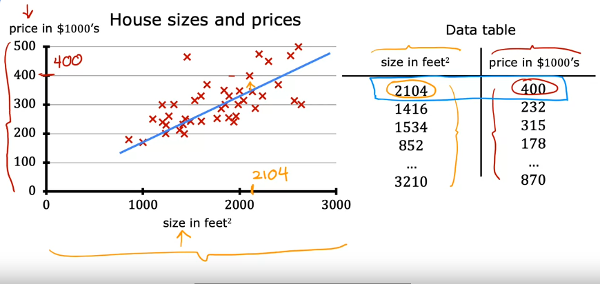

# Linear Regression with one variable

Linear Regression model just means fitting a straight line to your data. It’s probably the most widely used learning algorithm in the world today.

Let’s assume we want to predict the price of a house based on the size of the house. In this particular example, we’re going to use a dataset on house sizes and prices from Portland, a city in the United States.

So here is the graph where on the horizontal axis is the size of the house in square feet, and on the vertical axis is the price of a house in thousands of dollars. So in red crosses these are the data points for various houses in the dataset. Each of these little crosses is a house with the size and the price that it most recently was sold for. Now let’s assume that if you’re a real estate agent in Portland and you’re helping a client to sell her house. She is asking you, how much do you think I can get for this house? So this dataset might help you to estimate the price she could get for it. You start by measuring the size of the house, and it turns out that the house is 1250 square feet. How much do you think this house could sell for? One thing you could do this, you can build a linear regression model from this dataset. Your model will fit a straight line to the data, which might look like this. Based on this straight line fit to the data, you can see that the house is 1250 square feet, it will intersect at the particular point there, and if you trace that to the vertical axis on the left, you can see the price is maybe around $220,000. So this is an example of a supervised learning model. We call this supervised learning because you are first training a model by giving data that has right answers because you get the model examples of houses with both the size of the house, as well as the price that the model should predict for each house. This linear regression model is a particular type of supervised learning model. It’s called a regression model because it predicts numbers as the output like prices in dollars. Any supervised learning model that predicts in a number such as 220,000 or 1.5 or negative 33.2 is addressing what’s called a regression problem. Linear regression is one example of a regression model. But there are other models for addressing regression problems too.

In contrast with the regression model, the other most common type of supervised learning model is called a classification model. Classification model predicts categories or discrete categories, such as predicting if a picture is of a cat, or a dog, or if given a medical record, it has to predict if a patient has a particular disease.  

In classification there are only a small number of possible outputs. If your model is recognizing cats versus dogs, that’s two possible outputs. Or maybe you’re trying to recognize any of 10 possible medical conditions in a patient, so there’s a discrete, finite set of possible outputs. We call it a classification problem, whereas in regression, there are infinitely many possible numbers that the model could output.

In addition to visualising the data as a plot on the left, there’s one another way of looking at the data that would be useful, and that’s a data table on the right in the above image. The data comprises a set of inputs. This would be the size of the house, which is the column on the left. It also has outputs. You’re trying to predict the price, which is the column on the right in the image. Notice that the horizontal and vertical axes correspond to these columns, the size and the price. If you have say 47 rows in this data table, then there are 47 of these little crosses on the plot of the left, each cross corresponding to one row of the table. For example, the first row of the table is a house with size, 2104 square feet as marked in the image, and this house is sold for around $400,000. This first row of the table is plotted as the data point circled there in the image.

## Terminology

The dataset you saw above and that is used to train the model is called a training set. Let’s assume your client house is not in this dataset because it’s not yet sold, so no one knows what the price is. To predict the price of your client’s house, you first train your model to learn from the training set and that model can then predict your client’s house's price.

 In Machine Learning, the standard notation to denote the input here is lowercase x, and we call this the input variable, which is also called a feature or an input feature. For example, for the first house in your training set, x is the size of the house, so x equals 2,104. The standard notation to denote the output variable which you’re trying to predict, which is also sometimes called the target variable, is lowercase y. So, y is the price of the house, and for the first training example, this is equal to 400, so y equals 400. The dataset has one row for each house and in this training set, each house and in this training set, there are 47 rows with each row representing a different training example. We’re going to use lowercase m to refer to the total number of training examples, and so here m is equal to 47. To indicate the single training example, we’re going to use the notation parenthesis x, y. For the first training example, (x,y), this pair of numbers is (2104, 400). We have a lot of different training examples. We have 47 of them in fact.To refer to a specific training example, this will correspond to a specific row in this table on the left, I’m going to use the notation x superscript in parenthesis i, y superscript in parenthesis i. The superscript tells us that this is the ith training example, such as the first, second or third up to the 47th training example. I here, refers to a specific row in the table. For instance, in the first example of the training set, when i equals 1 in the training set, and so x superscript 1 is equal to 2,104 and y superscript 1 is equal to 400 and let’s add this superscript 1 here as well. Keep remember, this superscript i in parenthesis is not exponentiation.
