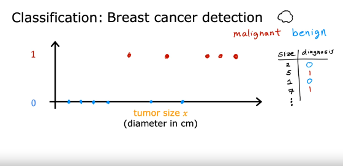

# Machine Learning Course by Andrew Ng

## What is Machine Learning?

Field of study that gives computers the ability to learn without being explicitly programmed.  
*– Arthur Samuel (1959)*

## Machine Learning Algorithms

- Supervised Learning (used most in many real-world applications)
- Unsupervised Learning

### Supervised Learning

It refers to algorithms that learn x to y mappings. The key characteristic of supervised learning is that you give your learning algorithm examples to learn from. That include the right answers, whereby right answer, I mean the correct label y for a given input x, and is by seeing correct pairs of input x and desired output of label y that the learning algorithm eventually learns to take just the input alone without the output label and gives a reasonably accurate prediction or guess of the output.

### Types of Supervised Learning Algorithm

1. Regression
2. Classification

In all of these applications, you will first train your model with examples of inputs x and the right answers, that is the labels y. After the model has learned from these input, output, or x and y pairs, they can take a brand new input x, something it has never seen before, and try to produce the appropriate corresponding output y.

By getting the data, a model can easily predict the price of a house of any size using this information or plotting graph of that particular size. For example, if a person chooses a house of 750 feet in size then the price will be predicted by analysing the lesser and higher values which means it must be between 180k to 210k by comparing with the other values. It is an example of a particular type of supervised learning called regression. By regression, we are trying to predict a number from infinitely many possible numbers such as the house prices in this example.

### Classification

The second major type of supervised learning algorithm is called a classification algorithm.
Example:

### Breast Cancer Detection

Build a machine learning system so that doctors can have a diagnostic tool to detect breast cancer. This is important because early detection could potentially save a patient’s life. Using a patient’s medical records your machine learning system tries to figure out if a tumour that is a lamp is malignant meaning cancerous or dangerous. Or if that tumour, that lump is benign, meaning that it’s just a lump that isn’t cancerous and isn’t that dangerous? A dataset has tumours of various sizes and these tumours are labelled as either benign, which is designated in the below example as 0 or malignant, which is designated in the below example as 1.

The reason it is different from regression is that it is trying to predict only a small number of possible outputs or categories. In this case, two possible outputs 0 or 1, benign or malignant. This is different from regression which tries to predict any number, all the infinitely many number of possible numbers. So the fact that there are only two possible outputs is what makes this classification. Because there are only two possible outputs or two possible categories in this example.
We can also plot the graph on a horizontal line like below:

Eg: If new patients walk in for a diagnosis and they have a lump, how will your system classify it as benign or malignant?
In this case, it turns out that you can also have more than two possible output categories. Maybe your learning algorithm can output multiple types of cancer diagnosis if it turns out to be malignant.

Classification algorithms predict categories. Categories don’t have to be numbers. It could be non numeric for example, it can predict whether a picture is that of a cat or a dog. And it can predict if a tumour is benign or malignant. Categories can also be numbers like 0, 1 or 0, 1, 2. But what makes classification different from regression when you’re interpreting the numbers is that classification predicts a small finite limited set of possible output categories such as 0, 1 and 2 but not all possible numbers in between like 0.5 or 1.7. In the example of supervised learning that we’ve been looking at, we had only one input value the size of the tumour. But you can also use more than one input value to predict an output. Below is the example:

Instead of just knowing the tumour size, you also have each patient’s age in years. This data set now has two inputs, age and tumour size. Circles are used to show patients whose tumours are benign and crosses to show the patients with a tumour that was malignant. So, when a new patient comes in, the doctor can measure the patient’s tumour size and also record the patient’s age. So that it can predict the patient’s tumour is benign or malignant? What the learning algorithm might do is find some boundary that separates out the malignant tumours from the benign ones. So the learning algorithm has to decide how to fit a boundary line through this data. The boundary line found by the learning algorithm would help the doctor with the diagnosis. In this case, the tumour is more likely to be benign.

Keep remember in other machine learning problems often many more input values are required.
