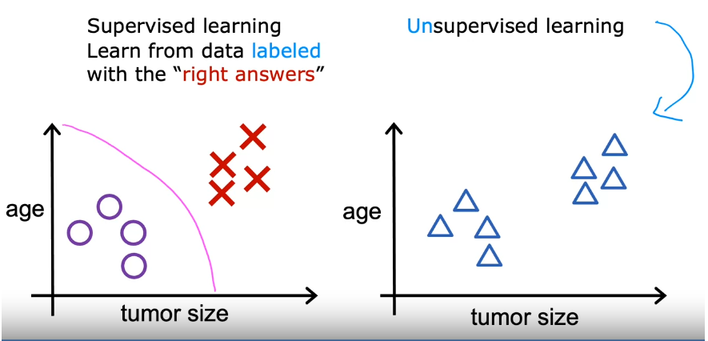
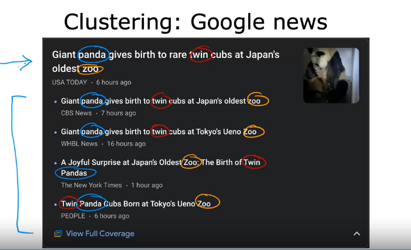
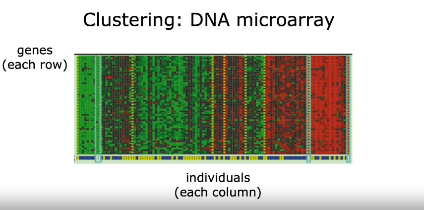
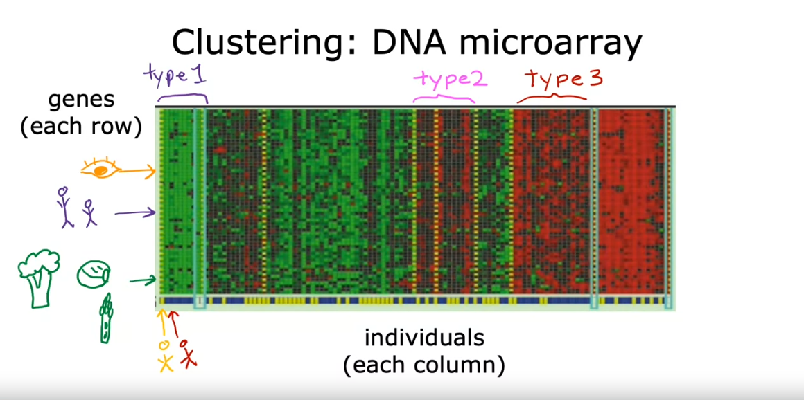
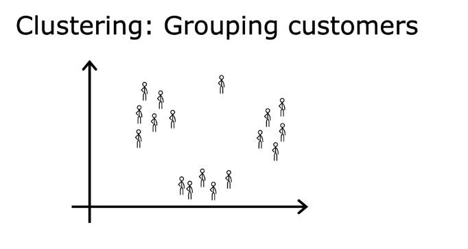
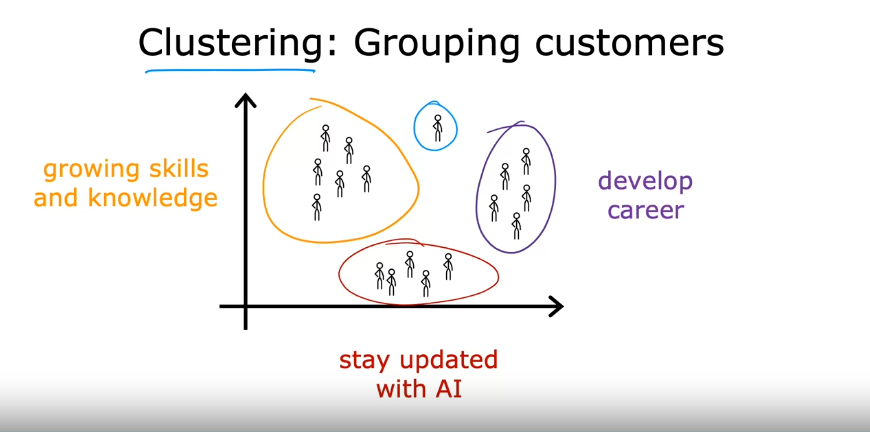

# Machine Learning Course by Andrew Ng

## What is Machine Learning?

Field of study that gives computers the ability to learn without being explicitly programmed.  
*– Arthur Samuel (1959)*

## Machine Learning Algorithms

- Supervised Learning (used most in many real-world applications)
- Unsupervised Learning

### Unsupervised Learning

In unsupervised learning, we’re given data that isn’t associated with any output labels y. Example you’re given data on patients and their tumor size and the patient’s age. But not about whether the tumor is benign or malignant, so the dataset looks like the graph on the right as shown in below fig.

In unsupervised learning, we’re not asked to diagnose whether the tumor is benign or malignant, because we’re not given any labels. Our job is to find some structure or some pattern or just find something interesting in the data. This is called unsupervised learning. We call it unsupervised because we’re not trying to supervise the algorithm to give some quote right answer for every input, instead, we asked the algorithm to figure out all by yourself what’s interesting. Or what patterns or structures that might be in this data, with this particular data set. An unsupervised learning algorithm might decide that the data can be assigned to two different groups or two different clusters. And so it might decide, that there’s one cluster or group over here, and there’s another cluster or group over here. This is a particular type of unsupervised learning, called a clustering algorithm. Because it places the unlabeled data, into different clusters and this turns out to be used in many applications. For example, clustering is used in google news , what google news does is everyday it goes and looked at hundreds of thousands of news articles on the internet, and groups related stories together. 

For example, here is a sample from Google News, where the headline of the top article is that a giant panda gives birth to rear twin cubs at Japan’s oldest zoo. But there are other related articles too. Maybe from the headlines alone, you can start to guess what clustering might be doing. Notice that the word “panda” appears in all of the related articles and notice the word “twin” also appears in all five articles. And the word “zoo” also appears in all of these articles, so the clustering algorithm is to find articles. All of the hundreds of thousands of news articles on the internet that day, finding the articles that mention similar words and grouping them into clusters. And the most interesting thing is that this clustering algorithm figures out on its own without supervision which word suggests that certain articles are in the same group.

### Second example of Clustering

This image shows a picture of DNA microarray data, these look like tiny grids of a spreadsheet. And each tiny column represents the genetic or DNA activity of one person.

For example, the entire column highlight with the yellow and red colour is for different people's DNA. Each row represents a particular gene, as an example yellow marked symbol represents a gene that affects eye colour, or two peoples symbol with purple colour represents a gene that affects how tall someone is. Researchers have even found a genetic link to whether someone dislikes certain vegetables such as broccoli, or brussels sprouts, or asparagus. The idea is to measure how much certain genes are expressed for each individual person. So, these colours red, green, grey, and so on, show the degree to which different individuals do, or do not have a specific gene active. And we can run a clustering algorithm to group individuals into different categories or different types of people like maybe these individuals that group together, and in the above portion call the type one. And others are specifically grouped into type two and type three. This is unsupervised learning, because we’re not telling the algorithm in advance, that there is a type one person with certain characteristics. Or a type two person with certain characteristics, instead what we’re saying is here’s a bunch of data, I don’t know what the different types of people are but can you automatically find the structure into data. And automatically figure out the major types of individuals, since we’re not giving the algorithm the right answer for the examples in advance.  This is unsupervised learning.

### Third example of Clustering

Many companies have huge databases of customer information given this data. Can you automatically group your customers into different market segments so that you can more efficiently serve your customers.

Concretely, the deep learning dot AI team did some research to better understand the deep learning community. And why different individuals take these classes, subscribe to the batch weekly newsletter, or attend our AI events. Let’s visualise the deep learning dot AI community, as this collection of people running clustering. Market segmentation found a few distinct groups of individuals, one group’s primary motivation is seeking knowledge to grow their skills. A second group’s primary motivation is looking for a way to develop their career. And yet another group wants to stay updated on how AI impacts their field of work. This is a clustering that tries to better serve as a community. Or in case you want something totally different than the other three categories. To summarise, a clustering algorithm is a type of unsupervised learning algorithm, takes data without labels and tries to automatically group them into clusters.

### Formal definition of Unsupervised Learning

In supervised learning, the data comes with both inputs x and outputs labels y, while in unsupervised learning, data only comes with inputs x, but not output labels y. And algorithm has to find some structure, some pattern, or something interesting in the data. As we’ve seen above one type of unsupervised learning which is clustering (group similar data points together). Later on we will also discuss about another types. One is called anomaly detection ,which is used to detect unusual events. This turns out to be really important for fraud detection in the financial system, where unusual events, unusual transactions could be signs of fraud and for many other applications. And also learn about dimensionality reduction. Which takes a big dataset and almost magically compresses it to a much smaller dataset while losing as little information as possible.
